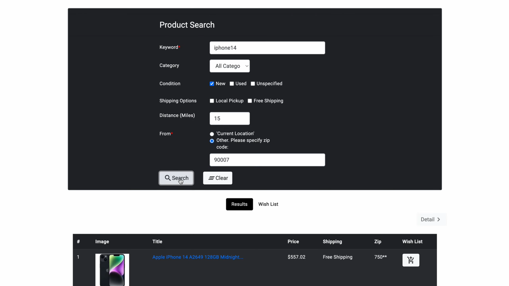
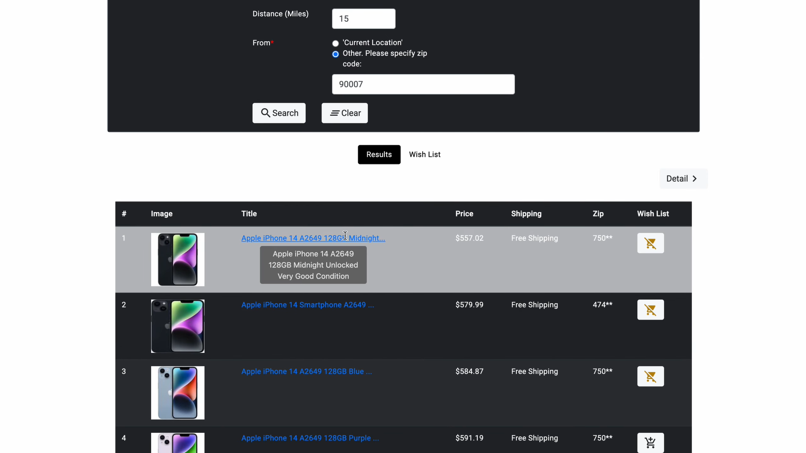
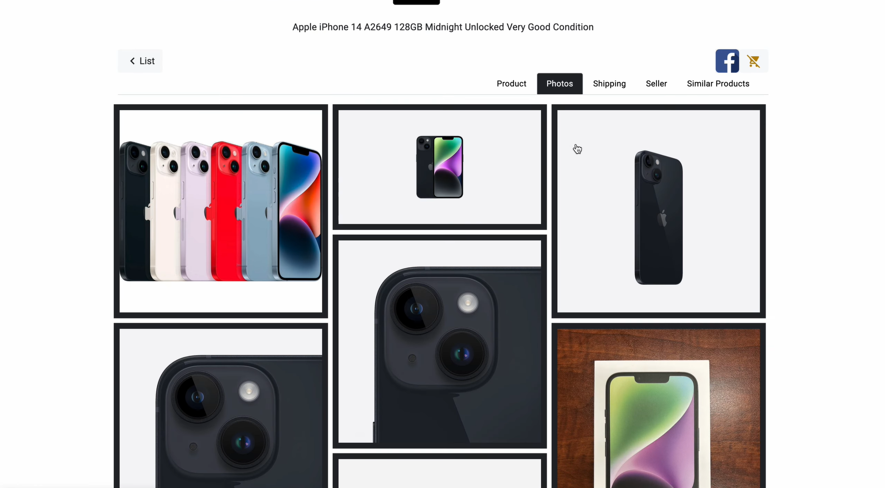
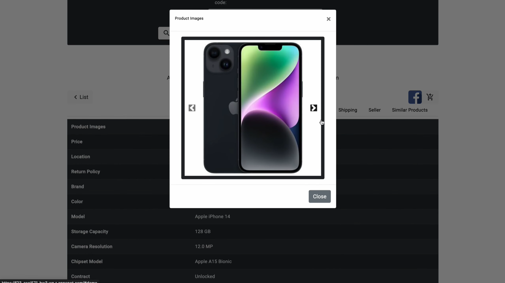
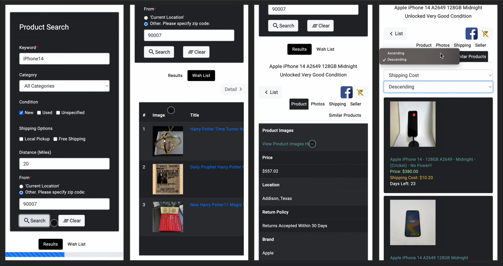

# eBaySearch - Angular App

## Description

An Angular App that provides eBay product search and wishlist management.

## Technologies Used

- **Front-end:**
  - Angular 16.2.9
  - ProgressBar
- **Backend:**
  - Node.js
  - Axios
- **Database:**
  - MongoDB
- **APIs:**
  - eBay API
  - Google Customized Search API
  - IPInfo
- **UI:**
  - Bootstrap
  - Material Design Icons
  - Responsive Design
- **Cloud:**
  - AWS

## Features

1. **Advanced Search Tab:**

   - Keywords, category, condition, shipping options, distance.

2. **Product Details:**

   - Basic details, photos, shipping info, seller info, similar products.
   - Visually appealing cards presenting search results.

   - Share product details via links.

3. **Wishlist:**

   - Add/remove products to/from wishlist.

4. **Cloud Integration:**

   - Save personal wishlist to the cloud.

5. **UI Design:**

   - Good-looking Angular web app
   - responsive UI design, supporting mobile phone view.

## Getting Started

Build Angular App. This will generate a dist folder. Then move the project folder inside to the node folder.

```
ng build --prod
```

Run the app.js file

```js
node server.js
```

## Screenshots















